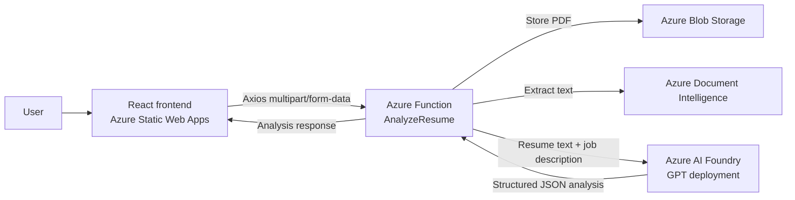

# ElCorrecto

ElCorrecto is a resume-to-role analysis application. Upload a CV as a PDF, paste a job description, and receive an AI-powered comparison showing the match score, matched skills, missing skills, and suggested improvements.

The application uses a React and TypeScript frontend with Ant Design and Tailwind CSS. Its Azure Functions backend uploads the resume to Azure Blob Storage, extracts text with Azure Document Intelligence, and sends the extracted resume and job description to Azure Foundry for analysis.

## Project structure

```text
api/       Azure Functions API and Azure service integrations
backend/   Express API serving job listings and user profiles (TypeORM on Azure SQL + Blob Storage)
frontend/  React, TypeScript, Vite, Ant Design, and Tailwind UI
bruno/     Bruno collection for testing the API
```

## Application architecture



The application is split into two deployable layers:

- **Frontend:** A Vite-powered React and TypeScript single-page application hosted on Azure Static Web Apps. It handles PDF selection, job-description input, loading and error states, and result presentation. The Azure Function URL is supplied through `VITE_AZURE_FUNCTION_URL`, and the jobs/profile backend through `VITE_BACKEND_BASE_URL` (the `/api/jobs` and `/api/profile` paths are appended in code — see `frontend/src/constants/api.ts`).
- **API:** A Node.js Azure Functions v4 HTTP API hosted in the `analyze-resume` Function App. It validates the multipart request, uploads the PDF, extracts resume text, calls Azure AI Foundry, and returns typed JSON.
- **Storage and AI services:** Blob Storage retains the uploaded PDF, Document Intelligence performs OCR and text extraction, and Azure AI Foundry evaluates the resume against the job description.

The browser communicates only with the HTTP Function endpoint. Azure credentials remain server-side in Function App environment variables; the frontend exposes only its public API URL.

## How it works

1. The user drops a PDF resume into the frontend.
2. The user pastes the target job description.
3. The frontend sends both fields as `multipart/form-data` with Axios.
4. The Azure Function stores the PDF in Blob Storage.
5. Document Intelligence extracts the resume text.
6. Azure Foundry compares the resume with the job description.
7. The frontend displays the structured analysis.

## Setup

Install dependencies in both workspaces:

```bash
npm install --prefix api
npm install --prefix backend
npm install --prefix frontend
```

Copy the API settings template and add your Azure credentials:

```bash
cp api/local.settings.example.json api/local.settings.json
```

The frontend Function URL is configured in `frontend/.env`. Use `frontend/.env.example` as a template when setting up another environment. Never commit real secrets or local settings files.

Copy the jobs/profile backend's env template and add your credentials:

```bash
cp backend/.env.example backend/.env
```

`backend/.env` needs the Azure SQL Database connection details (`SQL_SERVER`, `SQL_DATABASE`, `SQL_USER`, `SQL_PASSWORD`) and the same Blob Storage connection string/container used by the `api` workspace, since profile resumes are stored in the same `resumes` container. Before running the backend for the first time, create the `Profiles` and `Jobs` tables by running [backend/sql/create-profiles-table.sql](backend/sql/create-profiles-table.sql) and [backend/sql/create-jobs-table.sql](backend/sql/create-jobs-table.sql) against the database (e.g. via the Azure Portal's Query Editor) and populate `Jobs` with your own listings. Both tables are accessed through TypeORM — see `backend/src/entities/`. The SQL server's firewall must allow the connecting IP — either your own machine's, or "Allow Azure services" for Azure-hosted deployments.

Required Azure services:

- Azure Storage Account with a `resumes` Blob container
- Azure SQL Database (for job listings and profile records)
- Azure Document Intelligence resource
- Azure AI Foundry model deployment
- Azure Function App

## Run locally

Start the Azure Functions API from the project root:

```bash
npm start
```

The API runs at `http://localhost:7071/api/analyze-resume`.

Start the jobs backend in a second terminal:

```bash
npm run start:backend
```

The jobs API runs at `http://localhost:4000/api/jobs` and the profile API at `http://localhost:4000/api/profile`. The frontend reads `VITE_BACKEND_BASE_URL` (e.g. `http://localhost:4000/`) and appends each path itself.

Start the frontend in another terminal:

```bash
npm run start:frontend
```

Open `http://localhost:5173/` in your browser.

## Build and checks

Build both applications:

```bash
npm run build
```

Run frontend checks:

```bash
npm --prefix frontend run lint
npm --prefix frontend run format:check
```

Format the frontend with Prettier:

```bash
npm --prefix frontend run format
```

## TODO

- Replace browser-based Auth0 token persistence with a server-side authentication flow using an HttpOnly session cookie.

## API request

The API expects a `POST` request with `multipart/form-data`:

- `resume`: PDF file
- `jobDescription`: job description text

The deployed Function endpoint is:

```text
https://analyze-resume-ebgeb5bkaubjchhu.westus3-01.azurewebsites.net/api/analyze-resume
```

A Bruno request is available in [bruno](bruno). The API-specific setup notes are in [api/README.md](api/README.md).
